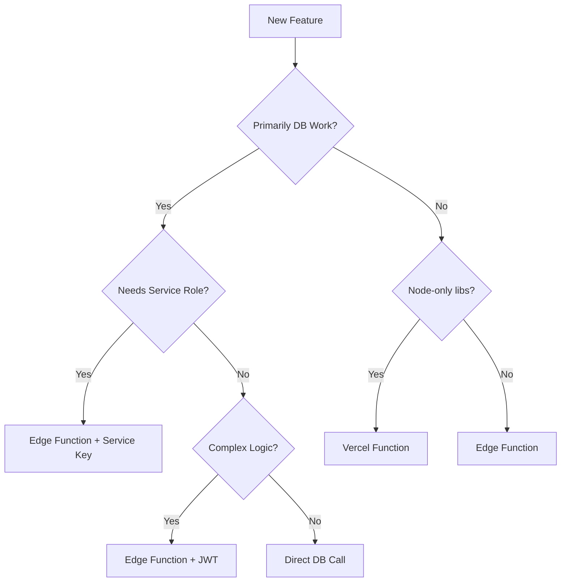

# Pattern Whisper - Architecture Decision Document

## Stack Decision: Vite + Supabase Edge Functions + Vercel

### Frontend
- **Vite + React + TypeScript** - Lightning fast dev, simple builds
- **Deployed to Vercel** - Static site with global CDN
- **Direct Supabase calls** - For simple RLS-protected reads

### Backend Logic Distribution

## Use Supabase Edge Functions for:

### 1. Pattern Analysis (Core Logic)
```typescript
// supabase/functions/analyze-pattern/index.ts
// Takes: ticker, date, window
// Returns: pattern matches with predictions
// Why: Talks directly to DB, needs vector search
```

### 2. User Operations (RLS-enforced)
```typescript
// supabase/functions/user-favorites/index.ts
// supabase/functions/save-search/index.ts
// Why: Pass JWT from client → RLS automatically enforced
```

### 3. Data Ingestion (Service Role)
```typescript
// supabase/functions/ingest-stocks/index.ts
// supabase/functions/ingest-crypto/index.ts
// Why: Needs SERVICE_ROLE_KEY, never touches browser
```

### 4. Scheduled Jobs
```typescript
// supabase/functions/daily-refresh/index.ts
// supabase/functions/clean-cache/index.ts
// Why: Runs via Supabase Scheduler, close to DB
```

### 5. Fire-and-Forget Analytics
```typescript
// supabase/functions/track-event/index.ts
// Why: Non-blocking, writes to user_activity table
```

## Use Vercel Functions for:

### 1. Twitter Card Generation
```typescript
// api/generate-share-image.ts
// Why: Needs Puppeteer/Playwright (Node-only)
```

### 2. External API Aggregation
```typescript
// api/fetch-market-data.ts
// Why: Complex rate limiting, multiple API calls
```

## Direct Database Calls (No Function) for:

### 1. Public Data Reads
```typescript
// In React component
const { data } = await supabase
  .from('stocks_daily')
  .select('*')
  .eq('ticker', 'NVDA')
  .order('d', { ascending: false })
  .limit(252);
```

### 2. User Favorites (RLS Protected)
```typescript
// RLS ensures users only see their own
const { data } = await supabase
  .from('user_favorites')
  .select('*');
```

## Security Model

### Client-Side (.env)
```env
VITE_SUPABASE_URL=https://ztgvmqdencafiyoaarpu.supabase.co
VITE_SUPABASE_ANON_KEY=eyJ... # Safe to expose
```

### Edge Function Secrets (never in client)
```bash
supabase secrets set SERVICE_ROLE_KEY=eyJ...
supabase secrets set DATA_PROVIDER_KEY=sk_...
```

### Vercel Environment Variables
```env
# Only for Vercel Functions
PUPPETEER_EXECUTABLE_PATH=/opt/chrome
```

## Development Workflow

### 1. Local Development
```bash
# Frontend
npm run dev

# Edge Functions
supabase functions serve analyze-pattern --env-file .env.local

# Database
supabase db reset  # Runs migrations + seeds
```

### 2. Deployment
```bash
# Frontend → Vercel
git push main

# Edge Functions → Supabase
supabase functions deploy

# Database migrations
supabase db push
```

## Why This Architecture Wins

### Speed
- **Zero cold starts** for Edge Functions (always warm)
- **Database proximity** - Functions run in same region as DB
- **CDN for frontend** - Static assets served from edge

### Security
- **RLS enforced** automatically with user JWT
- **Service keys isolated** in Edge Functions only
- **No API keys in browser** ever

### Developer Experience
- **One mental model** - Supabase client everywhere
- **TypeScript throughout** - Full type safety
- **Fast iteration** - Vite HMR + Edge Function hot reload

### Cost Efficiency
- **Pay per request** - No idle servers
- **Free tier generous** - 500K requests/month on Supabase
- **Vercel free tier** - Perfect for static sites

## Migration Path (When You Scale)

### Phase 1 (Current - MVP)
- All logic in Edge Functions
- Direct DB calls from React
- Basic caching in pattern_matches table

### Phase 2 (10K users)
- Add Redis for session cache
- Move heavy compute to Vercel Functions
- Implement query result caching

### Phase 3 (100K users)
- Dedicated vector database (Pinecone/Weaviate)
- Background job queue (Temporal/BullMQ)
- Read replicas for analytics

### Phase 4 (1M users)
- Microservices architecture
- Dedicated ML inference service
- Multi-region deployment

## Decision Tree Summary



## Gotchas Avoided

1. **Deno vs Node** - Most packages work, test early
2. **Secrets Management** - Each Edge Function has own secrets
3. **CORS Headers** - Set properly for browser calls
4. **Timeout Limits** - 30s for Edge Functions (plenty)
5. **Bundle Size** - Vite handles code splitting automatically